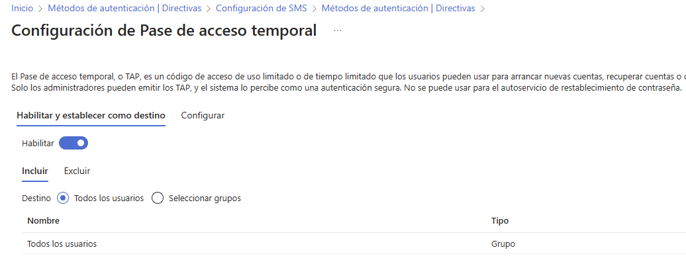
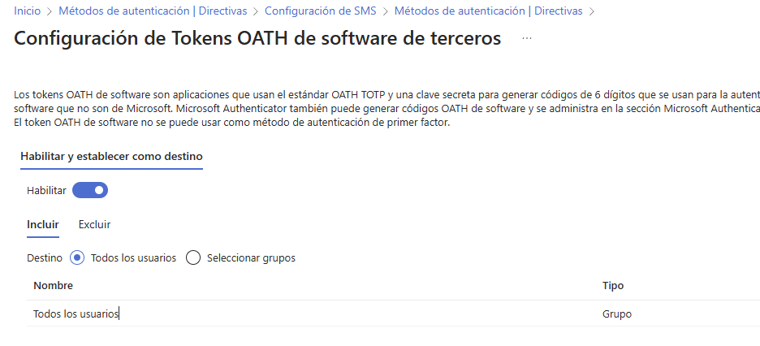

# Phishing_Resistant_MFA_M365
Usar factores de autenticacion modernos.

## Requisitos

* Tenant de M365.
* MV con Windows 11.

## Introducción

Respecto a la seguridad, sabemos tres cosas.

1) Las contraseñas no son muy seguras.
2) La autenticación multifactor es algo bueno.
3) Queremos una MFA que sea resistente a ataques de phishing.

La cuestión es cómo conseguir el tercer punto. Vamos a aprenderlo.

En este tutorial aprenderemos a crear MFA resistente al phishing usando los siguientes componentes de M365.

* `Passkeys`.
* `Políticas de Acceso Condicional` (Conditional Access Policies)
* `Fortaleza de autenticación`(Authentication Strength)
* `Windows Hello para la Empresa` (WHFB)
* `Temporary Access Passwords` (Contraseñas temporales o de un solo uso)

La principal idea que debes tener en cuenta es que vamos a sustituir la MFA de M365 "de toda la vida" (Legacy MFA) por las nuevas políticas de autenticación.

Accede a `Microsoft Entra ID`

Observa la siguiente imagen.

En la sección `Protección`(1), haz clic en `Métodos de autenticación`(2). Observarás las `Directivas de métodos de autenticación` presente en tu tenant de M365. La columna `Método`(3) lista los disponibles, mientras que en `Habilitado`(4) harás que esté disponible (o no) para tus usuarios.

## Passkey (FIDO2)

El método de autenticación `Clave de paso` (**Passkey**) basado en `FIDO2` en Microsoft 365 es un enfoque moderno de autenticación ***sin contraseñas*** que mejora la seguridad y la experiencia de usuario. Utiliza estándares de la [Fido Alliance](https://fidoalliance.org/) para permitir un acceso seguro basado en claves criptográficas, eliminando la necesidad de contraseñas tradicionales. 

Las `claves de paso` se almacenan de forma segura en dispositivos del usuario, como teléfonos o hardware de autenticación, y autentican al usuario mediante procesos biométricos o códigos PIN locales. Esto reduce significativamente el riesgo de ataques de phishing o de robo de contraseñas, ya que las credenciales nunca se transmiten ni se almacenan en servidores.

En la siguiente imagen puedes ver cómo este tenant no ofrece este medio a autenticación.

Para configurarlo haz clic en él.

Si haces clic en `Habilitar`(1), observarás cómo este método de autenticación queda disponible para todos los usuarios del tenant(2). Para configurarlo, haz clic en `Configurar` (3)

Observa la imagen. En ella verás las diferentes formas de configurar este método.

(1) `Permitir configuración de autoservicio` indica si los usuarios pueden registrar o configurar por sí mismos sus dispositivos FIDO2 sin la intervención del administrador.

(2) `Exigir la atestación` refiere a la validación de la autenticidad del dispositivo de seguridad (como un token físico o una llave de seguridad USB) cuando se registra para su uso en un sistema. La atestación es un mecanismo de verificación por el cual el dispositivo proporciona evidencia que permite al sistema de autenticación confirmar que es legítimo y que proviene de un fabricante confiable.

(3)(4) `Exigir las restricciones de clave` se refiere a cómo se deben aplicar y gestionar las claves de autenticación. Esta opción permite especificar que las claves utilizadas por los usuarios para la autenticación deben cumplir con ciertas restricciones o criterios.

Estas restricciones pueden incluir:

***Tipo de clave***: Especificar qué tipo de clave de seguridad puede usarse (por ejemplo, claves con autenticación biométrica o claves con PIN).

***Uso de claves residentes o no residentes***: Controlar si las claves de seguridad deben almacenar la información de autenticación en el dispositivo de la clave (clave residente) o si esta debe gestionarse de otra forma (clave no residente).

***Mecanismos de seguridad***: Restringir a ciertos niveles de seguridad, como el uso de claves que cumplan con estándares de autenticación específicos (por ejemplo, FIPS, nivel de certificación).

***Control de acceso***: Permitir o denegar claves de autenticación según políticas específicas de la organización.

(5) `AAGUID` (Authenticator Attestation GUID) es un identificador global único asignado a un tipo de autenticador específico. Este identificador permite que los servidores de autenticación reconozcan la clase o modelo de dispositivo autenticador que está siendo utilizado sin revelar detalles específicos sobre la instancia del dispositivo.

El **AAGUID** se utiliza principalmente en la fase de atestación, cuando un dispositivo autenticador presenta pruebas de que es confiable y legítimo. Por ejemplo, cuando un usuario registra un dispositivo FIDO2 en un sistema, el servidor recibe información que incluye el **AAGUID** para poder identificar de qué tipo de autenticador se trata y decidir si confía en él según sus políticas de seguridad.

Una vez configurada la política `FIDO2` haz clic en el botón ***Guardar***.

## Microsoft Authenticator

Este factor de autenticación está activado y configurado por defecto. Permite usar la aplicación `Microsoft Authenticator`, que es una aplicación de autenticación multifactor (MFA) desarrollada por Microsoft. Funciona generando códigos de verificación temporales o enviando notificaciones de aprobación a dispositivos móviles.

Haz clic en la pestaña ***Configurar*** para acceder a su configuración.

Cuando la opción `Permitir el uso de Microsoft Authenticator OTP` está activada, la aplicación genera un código de un solo uso basado en un algoritmo de tiempo (`TOTP`) que el usuario puede ingresar al autenticarse. Este código es creado automáticamente por la app y se actualiza cada 30 segundos.

El usuario solo necesita abrir la aplicación y ver el código para usarlo al iniciar sesión. Esto es diferente de la autenticación por notificaciones push, en la cual el usuario simplemente aprueba una solicitud en la app.

[Saber más sobre OTP](https://aka.ms/numbermatchdoc)

El resto de configuraciones son las siguientes.

## SMS 

Este método de autenticación envía un mensaje de texto al móvil que ha configurado el usuario en su MFA.

[Saber más sobre SMS](https://learn.microsoft.com/es-es/entra/identity/authentication/concept-authentication-phone-options#mobile-phone-verification)

## Pase de acceso temporal (TAP)

Es un código de acceso de uso limitado o de tiempo limitado que los usuarios pueden usar como factor de autenticación.

En la configuración puedes poner la duración y longitud del código.

[Saber más sobre TAP](https://learn.microsoft.com/es-es/entra/identity/authentication/howto-authentication-temporary-access-pass)

## Configuración de Tokens OATH de hardware (versión preliminar)

Se refiere a la posibilidad de utilizar tokens físicos de hardware que soporten el estándar `OATH` (Open Authentication) para la autenticación multifactor (MFA).

Estos tokens `OATH de hardware` generan contraseñas de un solo uso (`OTP`) que cambian periódicamente, similar a los códigos generados por aplicaciones de autenticación. La inclusión de esta configuración permite a los administradores configurar y gestionar estos tokens para los usuarios dentro de la organización como un método adicional de autenticación.

El término "versión preliminar" indica que la característica aún está en desarrollo o en una fase de prueba y podría no tener todas las funcionalidades finales o estar sujeta a cambios antes de su lanzamiento oficial.

## Configuración de Tokens OATH de software de terceros

Se refiere a la capacidad de usar tokens basados en el estándar `OATH` (Open Authentication OAUTH2) `generados por aplicaciones de autenticación de terceros` para el proceso de autenticación multifactor (MFA).

Estos tokens `OATH` suelen ser códigos temporales de un solo uso (`TOTP` - Time-based One-Time Password) que se regeneran periódicamente y se utilizan como un segundo factor de autenticación. Esto significa que los usuarios pueden configurar aplicaciones como `Google Authenticator`, `Authy`, o cualquier otra compatible con `OATH` para generar códigos de verificación que pueden utilizarse al iniciar sesión en servicios de Microsoft que requieren MFA, en lugar de depender únicamente de la aplicación `Microsoft Authenticator`.

Esta opción es útil para usuarios que prefieren usar un autenticador de terceros o que ya tienen configuraciones existentes en otras aplicaciones de autenticación.

## Configuración de llamada de voz

Se refiere a un método alternativo de autenticación en el que se te puede llamar por teléfono para verificar tu identidad. En lugar de utilizar un mensaje de texto (SMS) o una notificación en la app de Authenticator, se puede recibir una llamada telefónica automática que te pedirá que presiones una tecla (por ejemplo, "1") para confirmar que eres tú quien está intentando acceder a la cuenta.

[Saber más sobre Llamada de voz](https://aka.ms/phonecalldoc)

## Configuración de OTP de correo electrónico

Se refiere a la opción de usar un código de un solo uso (`OTP`, por sus siglas en inglés) que se envía por correo electrónico como un método de autenticación adicional. Este código se utiliza como parte de la autenticación multifactor (MFA), y es una forma de verificar la identidad del usuario al intentar acceder a una cuenta o servicio de Microsoft.

Cuando se configura esta opción, cada vez que se inicie sesión en una cuenta de Microsoft, el sistema envia un correo electrónico con un código OTP al correo electrónico registrado. El usuario debe ingresar ese código en el portal para completar el proceso de autenticación.

## Configuración de Autenticación basada en certificados

Se refiere al uso de `certificados digitales` para autenticar a un usuario, en lugar de las tradicionales contraseñas o incluso códigos generados por la aplicación de autenticación.

Cómo funciona:

1) ***Generación de Certificado***: El usuario debe tener un certificado digital que esté instalado en su dispositivo o en un sistema de administración de identidades (como un proveedor de servicios de identidad que soporte certificados).

2) ***Autenticación***: En lugar de ingresar una contraseña, el sistema verifica la autenticidad del certificado. Esto puede hacerse a través de un servidor o un sistema que valide el certificado presentado por el dispositivo del usuario.

3) ***Uso de Microsoft Authenticator***: Si se habilita la autenticación basada en certificados, Microsoft Authenticator puede gestionar o almacenar los certificados necesarios en el dispositivo del usuario para permitir el acceso a aplicaciones o servicios protegidos.

Este método se considera más seguro que las contraseñas tradicionales porque es más difícil de replicar o robar que una clave secreta, y su uso es frecuente en entornos corporativos que requieren altos niveles de seguridad, como acceso a aplicaciones críticas o redes privadas.

## Creación de una nueva 'Authentication Strength'

Generalmente las organizaciones están interesadas en un subconjunto de los factores de autenticación detallados anteriormente. La selección de los factores deseados se conoce como `Authentication Strength` o `Niveles de intensidad de autenticación`.

El tentant ya posee definidos diferentes `Authentication Strength`, tal y como puedes ver en la siguiente imagen.

Si haces clic en el `Authentication Strength` denominado ***Multifactor authentication*** verás los métodos disponibles.

Generalmente desearás crear tu propia combinación de factores de autenticación. Para ello, regresa a la pantalla anterior y haz clic en `+ Nueva intensidad de autenticación`.

Observa la imagen.

De las combinaciones posibles, se recomienda usar aquellas que ofrezcan ***MFA resistente a la suplantación de identidad***, pues es el objetivo de este tutorial.

Finaliza el asistente y comprobarás que se ha creado tu nueva intensidad de autenticación.

Es el momento de asignar este `Authentication Strength` a tus usuarios.

## Aplicar el Authentication Strength por medio de una directiva de Acceso Condicional.

La aplicación del `Authentication Strength` a los usuarios se hace por medio de una directiva de `Acceso Condicional`. 

En `Microsoft Entra ID`, en la seccion `Protección`, selecciona `Acceso condicional` (`Conditional Access`) y luego crea una ***Nueva directiva***.

Estudia la siguiente imagen.

En (1) pon en nombre que desees a esta directiva de `Acceso condicional`. A continuación, en (2) selecciona los usuarios que la tendrán aplicada.

Los recursos de destino son los servicios de M365 en la nube (3), observa como se ha cambiado en nombre y ahora se denomina `Todos los recursos`.

En `Grant` (Condeder) (4)  fíjate como en la lista aparece `Requerir intensidad de autenticación` (5). Selecciona la casilla de verificación.

Una vez seleccionada (1) despliega la lista (2) y en ella selecciona la `Intensidad de autenticación` que creaste antes. Haz clic en ***Seleccionar***.

Por último, ***Activa*** la directiva y haz clic en ***Crear***.

Verás como tu directiva se ha creado y está activa.

Enhorabuena, acabas de aprender a configurar el tenant para usar MFA resistente al phishing.

